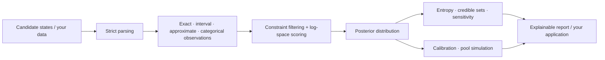
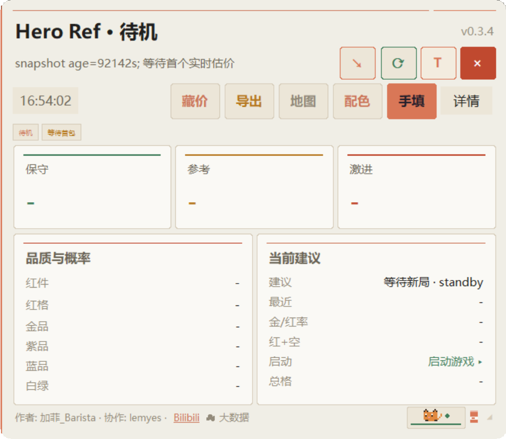

<p align="right"><a href="README.md">简体中文</a> · <strong>English</strong></p>

# BidKing Inference

[](https://github.com/SeasonCake/bidking-inference/actions/workflows/ci.yml)
[](https://github.com/SeasonCake/bidking-inference/releases)
[](LICENSE)
[](pyproject.toml)

**Turn incomplete observations into explainable estimates and probabilities.**

BidKing combines item counts, occupied cells, quality, and revealed clues during an
auction to provide conservative, reference, and aggressive bidding estimates, followed
by settlement review. This repository also offers a standalone Python inference toolkit,
early desktop implementation, and reproducible engineering case studies: a path from
the mathematics to a working product architecture.

[Download 0.3.5 for Windows](https://github.com/SeasonCake/bidking-inference/releases/tag/product-v0.3.5) ·
[Run the toolkit](#quick-start) · [Explore failure workflows](docs/FAILURE_WORKFLOWS.md) ·
[Watch the product demo](https://www.bilibili.com/video/BV15z4C6SEoz/)

0.3.5 is released, adding personal bidding presets and improving calculation refresh
and startup handling. See [version status and remaining work](docs/DEVELOPMENT_STATUS.md).
The public Python toolkit retains its separate `v0.1.0` version;
[the older hotfix1 download](https://github.com/SeasonCake/bidking-inference/releases/tag/product-v0.3.4-hotfix1) remains available.

## Where to start

| Layer | Included | Useful for |
| --- | --- | --- |
| Windows application | live estimates, three bidding references, candidate details, minimap, and settlement review | trying the product; trial and activation follow the in-app instructions |
| Python inference toolkit | strict observations, weighted posterior, joint enumeration, credible sets, calibration, sensitivity, and pool simulation | building an inference tool with your own data |
| Real early source | the `v0.2.0-hotfix1` Tk interface, reference engine, inference, and simulation source | studying real UI/state/inference/presentation collaboration |
| Frozen old data | the last `<0.2.8` maps, heroes, items, drop mapping, and quality weights | studying historical schemas and data modeling; not current game authority |
| Engineering methods | tests, CLI, boundary verification, and companion evidence-first skills | reusing verification and agent-compatibility workflows |
| Failure workflows | atomic JSON snapshots, refresh handles and independent save outcomes; nine synthetic scenarios | adapting small mechanisms and reporting reproducible failure cases |

## Problems it can solve

- **Inference from partial observations:** preserve and normalize all feasible candidates
  when only intervals, approximate values, or categories are known.
- **Multi-field scoring:** combine hard constraints and soft evidence in log space.
- **Uncertainty explanations:** report entropy, effective sample size, credible sets, and
  stable rejection reasons.
- **Evidence influence:** remove one term at a time and measure posterior total variation
  and Jensen-Shannon divergence.
- **Forecast calibration:** compute Brier score, log loss, ECE/MCE, and reliability bins.
- **Reproducible simulation:** sample weighted discrete pools with or without replacement
  under a fixed seed.



## 30-second example

```python
from auction_inference import (
    ApproximateObservation,
    Candidate,
    EvidenceTerm,
    IntervalObservation,
    infer_weighted_posterior,
)

candidates = (
    Candidate("compact", {"count": 8, "value": 900}, 0.3),
    Candidate("balanced", {"count": 12, "value": 1250}, 0.5),
    Candidate("dense", {"count": 16, "value": 1700}, 0.2),
)
evidence = (
    EvidenceTerm("count", IntervalObservation(8, 16)),
    EvidenceTerm("value", ApproximateObservation(1300, 250)),
)

posterior = infer_weighted_posterior(candidates, evidence)
print({row.label: round(row.probability, 4) for row in posterior.rows})
```

Maintained APIs use only the Python standard library. Invalid shapes, booleans posing as
integers, non-finite values, and empty candidate sets fail closed.

## Product context

The 0.3.4 workflow has three visible stages: wait for a new session, let the tool update
its estimate from public information during bidding, then compare the estimate with the
settlement result. Select any thumbnail to view the full image.

<table>
  <tr>
    <td width="26%" align="center">
      <a href="docs/assets/screenshots/bidking-v0.3.4-standby.png">
        
      </a>
      <br><strong>1. Standby</strong><br><sub>Open the tool and wait for a new session</sub>
    </td>
    <td width="37%" align="center">
      <a href="docs/assets/screenshots/bidking-v0.3.4-live-bidding.png">
        
      </a>
      <br><strong>2. Live bidding</strong><br><sub>Read public facts and update the estimate</sub>
    </td>
    <td width="37%" align="center">
      <a href="docs/assets/screenshots/bidking-v0.3.4-settlement.png">
        
      </a>
      <br><strong>3. Settlement</strong><br><sub>Compare the result, delta, and session record</sub>
    </td>
  </tr>
</table>

<p align="center">
  <strong>▶ <a href="https://www.bilibili.com/video/BV15z4C6SEoz/">Watch the complete BidKing 0.3.4 gameplay demo</a></strong>
</p>

<details>
<summary><strong>View historical interfaces</strong></summary>

<p align="center">
  
  <br><em>Earlier compact dark layout.</em>
</p>

<p align="center">
  
  <br><em>Earlier live integration, map view, and settlement inference.</em>
</p>

</details>

Third-party game imagery, names, trademarks, and assets visible in screenshots are not
covered by this repository's MIT License. See [`NOTICE.md`](NOTICE.md) and the
[screenshot notes](docs/assets/screenshots/README.md).

## Public code map

| Path | Contents |
| --- | --- |
| [`src/auction_inference`](src/auction_inference) | maintained domain-neutral inference package |
| [`calibration.py`](src/auction_inference/calibration.py) | binary forecast calibration and reliability bins |
| [`sensitivity.py`](src/auction_inference/sensitivity.py) | distribution shift and leave-one-evidence-out ranking |
| [`examples/`](examples) | constraints, posterior, joint state, simulation, adapters, calibration, and sensitivity |
| [`legacy/source-v0.2.0-hotfix1`](legacy/source-v0.2.0-hotfix1) | 56 real early source files, 1.59 MB |
| [`legacy/data-v0.2.7-hotfix3`](legacy/data-v0.2.7-hotfix3/data/processed) | 7 frozen historical tables, 641 KB |
| [`legacy/README.md`](legacy/README.md) | exact provenance, manifest digests, limits, and exclusions |
| [`scripts/verify.py`](scripts/verify.py) | unified tests and public-boundary verification |

Legacy files preserve their original Git blobs. They are read-only references and are
outside the maintained package's Semantic Versioning contract.

## Quick start

**Use the calculator:** download the ZIP from the Release above and fully extract it.
Start `BidKingLive.exe` first, wait for the overlay, then launch the game from Steam.
Windows 10/11 64-bit is required; follow the first-run setup prompts.

**Run the open-source inference toolkit:**

Python 3.10 or newer is sufficient:

```powershell
git clone https://github.com/SeasonCake/bidking-inference.git
cd bidking-inference
python -m pip install .
auction-inference examples/synthetic_session.json
python scripts/verify.py
```

Selected standalone examples:

```powershell
python examples/constraint_filter.py
python examples/posterior_summary.py
python examples/joint_posterior.py
python examples/pool_simulation.py
python examples/calibration_and_sensitivity.py
python examples/evidence_lifecycle.py
python examples/failure_workflows.py
```

## Documentation

- [Three runnable failure workflows and contribution directions](docs/FAILURE_WORKFLOWS.md)
- [0.3.5 development progress and reusable workflows](docs/DEVELOPMENT_STATUS.md)
- [Hotfix1 engineering case study: completeness, revision identity, and posterior](docs/EVIDENCE_LIFECYCLE.md)
- [Public API](docs/PUBLIC_API.md)
- [Strict input schema](docs/INPUT_SCHEMA.md)
- [Open-source boundary](OPEN_SOURCE_BOUNDARY.md)
- [Legacy source and data](legacy/README.md)
- [Project relationship](PROJECT_RELATIONSHIP.md)
- [Contribution guide](CONTRIBUTING.md)
- [Maintenance and support](MAINTAINING.md)

## Companion skills

The companion repository
[`evidence-first-agent-skills`](https://github.com/SeasonCake/evidence-first-agent-skills)
publishes browser-edit verification, intent checkpoints, architecture-survey,
claim-verification, CLI-contract and agent-compatibility workflows distilled from
BidKing/LC2 engineering experience. Install them independently; the installation guide
includes an optional standing-route example.

## Demo and community

- [Complete BidKing 0.3.4 gameplay demo](https://www.bilibili.com/video/BV15z4C6SEoz/)
- [Author's Bilibili profile](https://space.bilibili.com/88048665)
- Public-code questions and feature proposals: [GitHub Issues](https://github.com/SeasonCake/bidking-inference/issues)
- Chinese-language user discussion and release feedback: QQ Group 3 `980106659`

## License and contribution

Open-source code uses [MIT](LICENSE); the Windows application uses its bundled
`LICENSE.txt`. The inference package retains its independent
[`v0.1.0`](https://github.com/SeasonCake/bidking-inference/releases/tag/v0.1.0) version line.
See [project scope](OPEN_SOURCE_BOUNDARY.md) and [NOTICE](NOTICE.md) for source and asset details.
Contributions use DCO 1.1 (`git commit -s`); no CLA is required.

If a tool or case study helps you, a Star is welcome. Reproducible Issues and improvement
PRs are equally appreciated.
