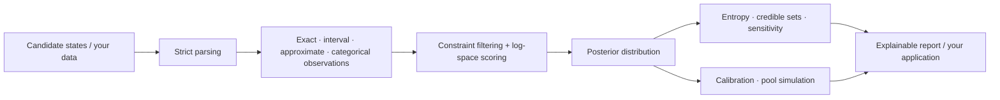
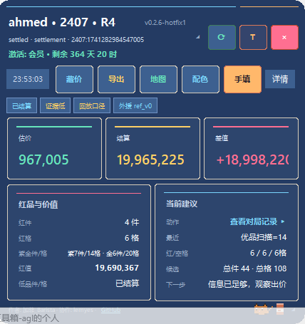
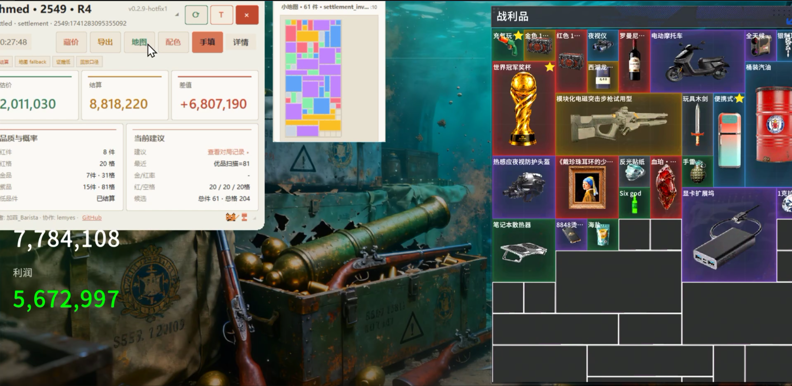

<p align="right"><a href="README.md">简体中文</a> · <strong>English</strong></p>

# BidKing Inference

[](https://github.com/SeasonCake/bidking-inference/actions/workflows/ci.yml)
[](https://github.com/SeasonCake/bidking-inference/releases)
[](LICENSE)
[](pyproject.toml)

A discrete-inference toolkit distilled from the engineering of the real BidKing product.
It targets finite-candidate problems with incomplete observations and explainable
answers: compose exact, interval, approximate, or categorical evidence; filter and score
candidates; normalize a posterior; inspect uncertainty; and verify behavior with
reproducible simulation.

The repository is no longer only a minimal mathematical example. Alongside the
maintained domain-neutral Python package, it publishes a reviewed layer of real early
product source and historical map/item tables so readers can study how an inference
prototype evolved into a desktop product.

> **Version note:** the private BidKing product follows the `0.3.4` line. The maintained
> package in this repository is independently versioned and currently released as
> [`v0.1.0`](https://github.com/SeasonCake/bidking-inference/releases/tag/v0.1.0). The legacy layer is frozen at
> `v0.2.0-hotfix1`/`0.2.7-hotfix3`; these are different artifacts with different version
> semantics.

## What is public now

| Layer | Included | Useful for |
| --- | --- | --- |
| Maintained open core | strict observations, weighted posterior, joint enumeration, credible sets, calibration, sensitivity, and pool simulation | building a small inference tool with your own public data |
| Real early source | the `v0.2.0-hotfix1` Tk interface, reference engine, inference, and simulation source | studying real UI/state/inference/presentation collaboration |
| Frozen old data | the last `<0.2.8` maps, heroes, items, drop mapping, and quality weights | studying historical schemas and data modeling; not current game authority |
| Engineering methods | tests, CLI, boundary verification, and companion evidence-first skills | reusing verification and agent-compatibility workflows |

The current product's capture/memory chain, `0.2.8+` adaptations and calibration,
client evolution, activation, servers, and production deployment remain private.

## Problems it can solve

- **Inference from partial observations:** preserve and normalize all feasible candidates
  when only intervals, approximate values, or categories are known.
- **Multi-field scoring:** combine hard constraints and soft evidence in log space.
- **Uncertainty explanations:** report entropy, effective sample size, credible sets, and
  stable rejection reasons.
- **Evidence influence:** remove one term at a time and measure posterior total variation
  and Jensen-Shannon divergence.
- **Forecast calibration:** compute Brier score, log loss, ECE/MCE, and reliability bins.
- **Reproducible simulation:** sample weighted discrete pools with or without replacement
  under a fixed seed.



## 30-second example

```python
from auction_inference import (
    ApproximateObservation,
    Candidate,
    EvidenceTerm,
    IntervalObservation,
    infer_weighted_posterior,
)

candidates = (
    Candidate("compact", {"count": 8, "value": 900}, 0.3),
    Candidate("balanced", {"count": 12, "value": 1250}, 0.5),
    Candidate("dense", {"count": 16, "value": 1700}, 0.2),
)
evidence = (
    EvidenceTerm("count", IntervalObservation(8, 16)),
    EvidenceTerm("value", ApproximateObservation(1300, 250)),
)

posterior = infer_weighted_posterior(candidates, evidence)
print({row.label: round(row.probability, 4) for row in posterior.rows})
```

Maintained APIs use only the Python standard library. Invalid shapes, booleans posing as
integers, non-finite values, and empty candidate sets fail closed.

## Product context

These historical screenshots show the real product setting that motivated the public
project.

<p align="center">
  
</p>

<p align="center"><em>Historical compact dark layout from an earlier development version.</em></p>

<p align="center">
  
</p>

<p align="center"><em>Historical live integration, map view, and settlement inference; a 0.3.4 demo video and current screenshots will follow.</em></p>

Third-party game imagery, names, trademarks, and assets visible in screenshots are not
covered by this repository's MIT License. See [`NOTICE.md`](NOTICE.md) and the
[screenshot notes](docs/assets/screenshots/README.md).

## Public code map

| Path | Contents |
| --- | --- |
| [`src/auction_inference`](src/auction_inference) | maintained domain-neutral inference package |
| [`calibration.py`](src/auction_inference/calibration.py) | binary forecast calibration and reliability bins |
| [`sensitivity.py`](src/auction_inference/sensitivity.py) | distribution shift and leave-one-evidence-out ranking |
| [`examples/`](examples) | constraints, posterior, joint state, simulation, adapters, calibration, and sensitivity |
| [`legacy/source-v0.2.0-hotfix1`](legacy/source-v0.2.0-hotfix1) | 56 real early source files, 1.59 MB |
| [`legacy/data-v0.2.7-hotfix3`](legacy/data-v0.2.7-hotfix3/data/processed) | 7 frozen historical tables, 641 KB |
| [`legacy/README.md`](legacy/README.md) | exact provenance, manifest digests, limits, and exclusions |
| [`scripts/verify.py`](scripts/verify.py) | unified tests and public-boundary verification |

Legacy files preserve their original Git blobs. They are read-only references and are
outside the maintained package's Semantic Versioning contract.

## Quick start

Python 3.10 or newer is sufficient:

```powershell
git clone https://github.com/SeasonCake/bidking-inference.git
cd bidking-inference
python -m pip install .
auction-inference examples/synthetic_session.json
python scripts/verify.py
```

Selected standalone examples:

```powershell
python examples/constraint_filter.py
python examples/posterior_summary.py
python examples/joint_posterior.py
python examples/pool_simulation.py
python examples/calibration_and_sensitivity.py
```

## Documentation

- [Public API](docs/PUBLIC_API.md)
- [Strict input schema](docs/INPUT_SCHEMA.md)
- [Open-source boundary](OPEN_SOURCE_BOUNDARY.md)
- [Legacy source and data](legacy/README.md)
- [Project relationship](PROJECT_RELATIONSHIP.md)
- [Contribution guide](CONTRIBUTING.md)
- [Maintenance and support](MAINTAINING.md)

## Medium open-core boundary

| Public | Retained |
| --- | --- |
| generic inference/calibration/sensitivity/simulation APIs | current game field mappings and consumers |
| synthetic data, examples, tests, and CLI | real user samples, capture, and memory acquisition |
| reviewed early source and frozen `<0.2.8` tables | `0.2.8+` models, current calibration, and decision policy |
| public engineering skills and verification workflows | activation, servers, production topology, commercial builds, and protection |

Developers receive a runnable generic toolkit and a meaningful real historical
implementation, but this repository alone cannot reconstruct the current BidKing
product. See [`OPEN_SOURCE_BOUNDARY.md`](OPEN_SOURCE_BOUNDARY.md).

## Companion skills

The companion repository
[`evidence-first-agent-skills`](https://github.com/SeasonCake/evidence-first-agent-skills)
publishes reusable architecture-survey, claim-verification, CLI-contract, and
agent-compatibility workflows distilled from BidKing/LC2 engineering experience.

## License and contribution

Copyright (c) 2026 SeasonCake. Released under the MIT License. Third-party game names,
text, and factual metadata in the historical tables remain subject to the rights
boundary in [`NOTICE.md`](NOTICE.md). Contributions use the Developer Certificate of
Origin 1.1 (`git commit -s`); no CLA is required.
