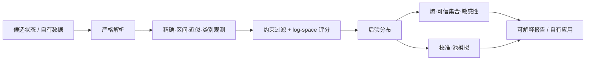

<p align="right"><strong>简体中文</strong> · <a href="README.en.md">English</a></p>

# BidKing Inference

[](https://github.com/SeasonCake/bidking-inference/actions/workflows/ci.yml)
[](https://github.com/SeasonCake/bidking-inference/releases)
[](LICENSE)
[](pyproject.toml)

一个从 BidKing 实际产品研发中抽象出来的离散推断工具箱。它面向“候选有限、观测不完整、答案需要
解释”的问题：把精确、区间、近似或类别证据组合起来，筛选候选状态、计算后验、检查不确定性，
并用可复现模拟验证结果。

本仓不再只是一个最小数学示例。除了持续维护的领域中立 Python 包，还公开了经过审查的早期真实
产品源码和旧地图/道具表，方便学习一个推断工具如何从原型演进为桌面产品。

> **版本说明：** BidKing 私有产品当前版本线为 `0.3.4`；本仓的维护包独立版本化，当前公开
> Release 为 [`v0.1.0`](https://github.com/SeasonCake/bidking-inference/releases/tag/v0.1.0)。历史源码层冻结在
> `v0.2.0-hotfix1`/`0.2.7-hotfix3`，三者不是同一个可执行产品，也不共用版本语义。

## 现在公开了什么

| 层 | 可以直接获得的内容 | 适合用途 |
| --- | --- | --- |
| 维护中的 open-core | 严格观测、加权后验、联合枚举、可信集合、校准、敏感性和池模拟 | 接入自己的公开数据，构建小型推断/估计工具 |
| 早期真实源码 | `v0.2.0-hotfix1` 的 Tk 主界面、参考引擎、推断和模拟源码 | 阅读真实 UI、状态、推断与展示如何协作 |
| 冻结旧数据 | 最后一个 `<0.2.8` 版本的地图、英雄、道具、掉落映射和品质权重 | 研究旧版数据建模和表结构；不代表当前游戏 |
| 工程方法 | 测试、CLI、边界验证，以及配套 evidence-first skills | 复用验证、架构调查和 agent 兼容流程 |

当前私有产品的采集/内存链、`0.2.8+` 适配与校准、客户端演进、激活、服务端和生产部署仍不公开。

## 它能解决什么

- **不完整观测推断**：只知道总数区间、近似值或某些类别时，保留所有可行候选并归一化概率；
- **多字段联合评分**：在 log-space 组合硬约束与软证据，避免很小先验下的数值下溢；
- **不确定性解释**：输出熵、有效样本量、可信集合和候选拒绝原因；
- **证据影响分析**：逐项移除证据，量化后验总变差和 Jensen-Shannon 距离，找出真正主导结果的字段；
- **预测校准检查**：用 Brier score、log loss、ECE/MCE 与可靠性分箱检查概率是否可信；
- **可复现模拟**：对带权离散池进行有/无放回抽样，固定 seed 重现统计结果。



## 30 秒示例

```python
from auction_inference import (
    ApproximateObservation,
    Candidate,
    EvidenceTerm,
    IntervalObservation,
    infer_weighted_posterior,
)

candidates = (
    Candidate("compact", {"count": 8, "value": 900}, 0.3),
    Candidate("balanced", {"count": 12, "value": 1250}, 0.5),
    Candidate("dense", {"count": 16, "value": 1700}, 0.2),
)
evidence = (
    EvidenceTerm("count", IntervalObservation(8, 16)),
    EvidenceTerm("value", ApproximateObservation(1300, 250)),
)

posterior = infer_weighted_posterior(candidates, evidence)
print({row.label: round(row.probability, 4) for row in posterior.rows})
```

所有维护中 API 只使用 Python 标准库。错误形状、布尔值冒充整数、非有限数和空候选集会 fail closed。

## 界面预览

0.3.4 的使用流程可以概括成三步：启动后等待新局，竞拍中自动读取公开信息并持续更新估值，
结算后对照实际结果复盘。点击任一缩略图可查看原图；演示视频将在完成后补充到这里。

<table>
  <tr>
    <td width="26%" align="center">
      <a href="docs/assets/screenshots/bidking-v0.3.4-standby.png">
        
      </a>
      <br><strong>① 待机</strong><br><sub>打开计算器，等待新局</sub>
    </td>
    <td width="37%" align="center">
      <a href="docs/assets/screenshots/bidking-v0.3.4-live-bidding.png">
        
      </a>
      <br><strong>② 对局</strong><br><sub>读取公开信息，实时更新估值</sub>
    </td>
    <td width="37%" align="center">
      <a href="docs/assets/screenshots/bidking-v0.3.4-settlement.png">
        
      </a>
      <br><strong>③ 结算</strong><br><sub>对照实际结果，查看差值并复盘</sub>
    </td>
  </tr>
</table>

<details>
<summary><strong>查看历史界面</strong></summary>

<p align="center">
  
  <br><em>早期紧凑深色布局。</em>
</p>

<p align="center">
  
  <br><em>早期实机联动、地图视图与结算推断。</em>
</p>

</details>

截图中的第三方游戏画面、名称、商标与素材不属于本仓 MIT 许可，详见
[`NOTICE.md`](NOTICE.md) 与[截图说明](docs/assets/screenshots/README.md)。

## 公开代码地图

| 路径 | 内容 |
| --- | --- |
| [`src/auction_inference`](src/auction_inference) | 当前维护的领域中立推断库 |
| [`calibration.py`](src/auction_inference/calibration.py) | 二元概率预测校准与可靠性分箱 |
| [`sensitivity.py`](src/auction_inference/sensitivity.py) | 分布漂移和 leave-one-evidence-out 影响排序 |
| [`examples/`](examples) | 约束、后验、联合状态、模拟、适配器、校准与敏感性示例 |
| [`legacy/source-v0.2.0-hotfix1`](legacy/source-v0.2.0-hotfix1) | 56 个真实早期源码文件，1.59 MB |
| [`legacy/data-v0.2.7-hotfix3`](legacy/data-v0.2.7-hotfix3/data/processed) | 7 份冻结旧表，641 KB |
| [`legacy/README.md`](legacy/README.md) | 精确来源、哈希摘要、限制与排除项 |
| [`scripts/verify.py`](scripts/verify.py) | 测试、截图、历史快照和公开边界统一验证器 |

历史层逐文件保持原 Git blob，不是从当前私有源码按文件名回抄；它是只读参考，不属于维护包的
Semantic Versioning 合同。

## 快速开始

Python 3.10 或更新版本即可：

```powershell
git clone https://github.com/SeasonCake/bidking-inference.git
cd bidking-inference
python -m pip install .
auction-inference examples/synthetic_session.json
python scripts/verify.py
```

常用独立示例：

```powershell
python examples/constraint_filter.py
python examples/posterior_summary.py
python examples/joint_posterior.py
python examples/pool_simulation.py
python examples/calibration_and_sensitivity.py
```

## 文档

- [公开 API](docs/PUBLIC_API.md)
- [严格输入 schema](docs/INPUT_SCHEMA.md)
- [开源边界](OPEN_SOURCE_BOUNDARY.md)
- [历史源码与数据](legacy/README.md)
- [项目关系](PROJECT_RELATIONSHIP.md)
- [贡献指南](CONTRIBUTING.md)
- [维护与支持](MAINTAINING.md)

## 中等开源边界

| 已公开 | 继续保留 |
| --- | --- |
| 通用推断/校准/敏感性/模拟 API | 当前游戏字段映射与消费者 |
| 合成数据、示例、测试和 CLI | 真实用户样本、抓包与内存采集 |
| 经审查的早期源码与 `<0.2.8` 冻结表 | `0.2.8+` 模型、当前校准和报价策略 |
| 公开工程 skills 和验证流程 | 激活、服务器、生产拓扑、商业构建与保护链 |

因此外部开发者可以获得可运行的通用工具和有研究价值的真实历史实现，但不能只靠本仓重建当前
BidKing 产品。完整合同见 [`OPEN_SOURCE_BOUNDARY.md`](OPEN_SOURCE_BOUNDARY.md)。

## 配套 skills

配套仓库 [`evidence-first-agent-skills`](https://github.com/SeasonCake/evidence-first-agent-skills)
公开了从 BidKing/LC2 工程实践中抽象出的通用流程：架构调查、结论验证、CLI 合同和 agent 兼容性。

## 许可证与贡献

Copyright (c) 2026 SeasonCake，以 MIT License 发布。历史表中的第三方游戏名称、文本和事实元数据
受 [`NOTICE.md`](NOTICE.md) 的权利边界约束。贡献采用 Developer Certificate of Origin 1.1
（提交时使用 `git commit -s`），不要求 CLA。
