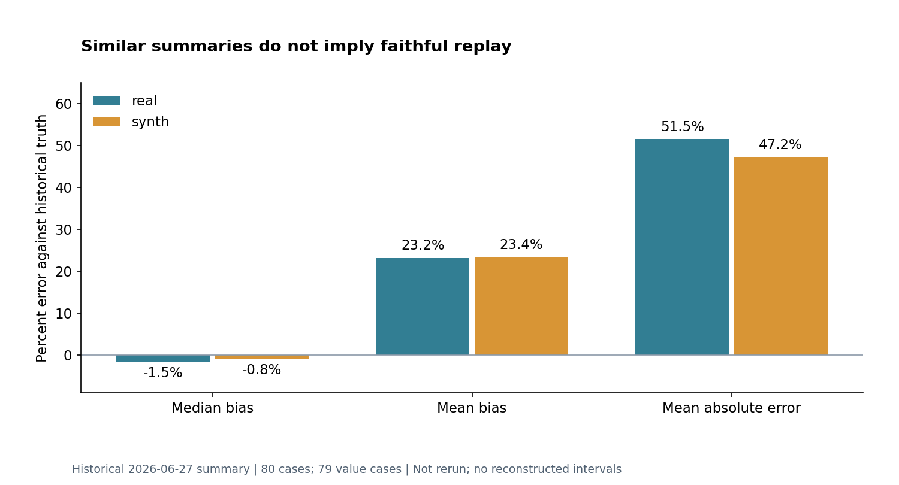
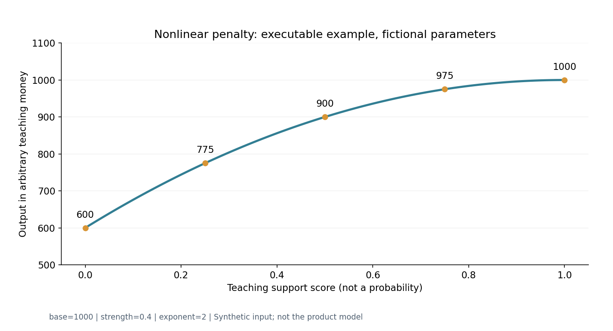

# 艾莎估价研究：更多信息为什么不一定得到更好的报价？

这里有三段基础研究代码、一个独立的非线性惩罚教学例、一个10件虚构仓库，以及四段来自2026年6—7月的真实开发案例。旧代码摘取与新教学代码分别标注；历史实验数据保留原时点，运行示例不会重新产生那些实验结果。

English summary: Three baseline standard-library research examples explain an inverted count window, a missing replay input channel, and per-round visibility. Historical aggregates are separately labeled. Fictional compensation arithmetic illustrates error cancellation; an additional standalone nonlinear penalty example exposes synthetic inputs and intermediate values. Neither is the production valuation formula. These modules are outside the stable `auction_inference` API.

## 运行和阅读

在仓库根目录使用 Python 3.10 或更新版本，不需要游戏、抓包、真实对局、物品目录或第三方包：

```console
python -m research.aisha
python -m research.aisha.penalty_example
python -m unittest discover -s tests -p test_research_aisha.py -v
```

第一条输出JSON：窗口边界、live/offline教学输入、五轮可见信息、虚构补偿算例，以及单独标为 `historical_aggregate` 的旧统计摘要。示例不写文件。固定整数seed使同一Python运行环境中的抽样可复现，不依赖文件名的进程随机hash。

| 入口 | 内容 |
|---|---|
| [windows.py](../../research/aisha/windows.py) | 两个旧窗口helper及显式分支顺序的教学wrapper |
| [replay_contract.py](../../research/aisha/replay_contract.py) | 旧可行格域helper、新公共事实适配示例 |
| [visibility.py](../../research/aisha/visibility.py) | 独立写的技能/道具可见性模拟器 |
| [penalty_example.py](../../research/aisha/penalty_example.py) | 全新通用惩罚算术、虚构参数、逐步输出；不是旧产品函数 |
| [toy_warehouse.json](../../research/aisha/fixtures/toy_warehouse.json) | 10件虚构物品，`synthetic: true`，任意教学价格 |
| [historical_summary.json](../../research/aisha/fixtures/historical_summary.json) | 旧报告summary白名单；没有原对局ID或逐样本行 |
| [来源清单](PROVENANCE.json) | 原commit、源path/blob、摘取和适配说明 |

本次聚焦检查覆盖27个unittest，包括故障正控、正常负控、信息不泄漏和跨进程hashseed确定性。它们只验证这里的教学模块，不代表重新验证旧引擎、真实样本池或当前产品。

## 先对齐单位

`count`是件，`cells`是占用格，`avg_cells`是格/件；金额/件与金额/格又是另外两种量。总格÷均格能约束件数，不能直接说明报价更准。这里不实现报价引擎。

艾莎技能逐轮揭白、绿、蓝、紫的整档轮廓与件数。教学代码保留白绿分开，同时示范历史引擎的 `q1=白+绿` 合并桶。R1只揭白，不能把白数当合并q1的精确总数；R2才有完整白绿合并数。金色扫描只给金色总格，既不是金件数，也不是金物品的身份或位置。

## A. 获得更多信息，候选窗口反而空了

6月29日的记录描述：宝光四鉴后，一个大仓R1估件中心从42变成58，三档参考价全空；当时引擎耗时约1.44ms。原因不是计算太慢，而是上限50与中心±2同时作用：

```text
center=42 → [40,44] → 有候选
center=58 → [56,50] → range为空
```

修订 `a0aaeacf` 的关键是顺序。已有固定品质件数推导出的可达band会先钳制或重定位窗口；只有仍倒置时才扩到中心±2，且仍受100上限约束。开发首版把expand放在band前，记录出现19处已有报价漂移，部分+67%至+260%；移后，旧76个clean真实文件的R1–R2记录救回16轮、回归0、超过3%的报价漂移0、R3+差异0。这是当时记录，本示例未重跑该实验；当时具体大仓的live复验仍另列待确认。

运行JSON中 `band_already_rescued` 的候选始终是45–48，打开或关闭expand都相同；`still_unreachable` 的中心105会得到103–100，仍然无解。原诊断note里出现“expanded”不代表候选一定非空。不能把这个修补写成“任何输入都保证出价”。

摘取范围与适配明确分开：第一个旧helper保持原方法体；第二个只把环境变量rollback读取改为显式布尔参数，计算与note保留。新wrapper负责输入检查、接收调用者提供的可达band，不推导真实物品组合。原无总格目标分支没有band步骤，示例 `without_grid_target` 保留直接expand顺序；不把两个分支混为一谈。来源条目：`aisha-early-window`。

可继续贡献的Issue：**“增加相邻cap边界与fixed-band已救回的例子”**。验收应同时证明原正常候选不变、倒置故障能触发、100以上仍可无解；不要求也不暗示真实报价实验通过。

## B. 模拟的是玩家看见的东西，不是结算答案

6月27日的合成系统拿完整结算仓，模拟艾莎逐轮技能与道具，以补充稀缺英雄样本。历史失误包括：只输入件数和形状下界，却漏掉整档精确占格；记录中一个0红仓被估出7件幻影红、估价+272%。另一个错误是R1把白数锁进合并q1，与道具揭绿发生冲突。问题出在信息语义和消费通道，不能只靠“再调一个参数”解决。

这里的模拟器独立重写，不搬原完整脚本。默认道具序列只是一个示例打法：

| 轮次 | 新技能信息 | 示例道具 | 可以知道 / 仍不知道 |
|---|---|---|---|
| R1 | 全部白色轮廓 | 宝光四鉴 | 四件品质和虚构粗位置；不带其形状/价值 |
| R2 | 全部绿色轮廓 | 抽检2 | 两件完整揭示；白绿合并件数可精确 |
| R3 | 全部蓝色轮廓 | 抽检1 | 一件完整揭示 |
| R4 | 全部紫色轮廓 | 金色扫描 | 金总格，仍不揭金件数/身份/位置 |
| R5 | 无新技能 | 无 | 沿用已有技能信息；不是通用的“整轮无新信息”规则 |

输出只用字段白名单新建可见对象。改变所有未鉴价物品的虚构价值，不会改变R1观察结果。技能轮廓不带价格；只有抽检命中的物品可以带价值。一次道具内部不重复，下一来源可以抽到已见同件：seed=0的R1会再命中白色 `toy-01`，它仍只计一次，来源列表同时保存技能和宝光。R4只用金扫时，隐藏金件不会被添进可见物品列表。

`q5_scan={"status":"missing"}` 与 `{"status":"known","cells":0}` 明确不同。旧合成脚本曾用 `>0` 才发送金扫字段；此处显式零是新教学契约，不冒充旧代码逐字行为。坐标是1基行列、矩形占格；粗位置的上下区划也只是教学选择。

轮次也经历过纠正。7月11日 `4489929a` 把沉船旧公开R3改为R1，并明确排位/hidden的单公开轮；别墅首波R1、后波R3，wire轮2不能直接当玩家R2。模拟器体现这个历史映射，对未标定图族报错；这不是对今天全部地图的保证。来源条目：`aisha-synthetic-visibility`、`aisha-public-round-correction`。

旧同仓real/synth报告80仓，价值指标有效79仓；真实与合成价值bias中位分别-1.5%/-0.8%，MAE分别51.5%/47.2%。同仓报价绝对差中位19.6%、均值31.4%，件数绝对差中位2件。它支持“部分机制和方向接近”，不支持“完全保真”。摘要没有单列paired分母，也没有可供重算置信区间的逐样本数据；后来的公开轮纠正进一步限制了旧报告对早轮时序的证明力。来源条目：`aisha-historical-summary`。

可继续贡献的Issue：**“增加仅品质→轮廓→完整揭示的同件升级序列”**。验收应检查价值何时可见、同件不重复计数、零扫描与未扫描不同；使用明确虚构仓，不需要提供真实对局。



图表只重绘上述历史摘要；[CSV](../assets/charts/aisha_historical_metrics.csv)保留百分数与有效价值样本数，
[生成脚本](../../research/historical_data/generate_charts.py)不读取原对局。
两组汇总接近，不代表逐仓报价相同：旧配对绝对差中位仍为19.6%。

## C. 总格误差变小，为什么报价没有改善？

7月1日 `40987026` 发现离线 `_build_snapshot` 把 `constraints.public_info` 留空，而线上本来已有 `public_numeric_facts`。修复是让离线也经过live公共数值契约；一个旧2401例子离线终于看到总均格3.957。这个故事不能写成“修好了线上缺字段”。

教学版live与修好后的offline都调用同一小适配器；`offline_legacy`故意遗漏通道作为故障正控。给定公开均格4格/件、件数区间20–30，可行总格为80–120：

```text
缺失公共事实：[60,100,140] 不变，status=missing
事实已到达：  [60,100,140] → [80,100,120]
本就在带内：  [90,100,110] 不变
```

可行域helper来自旧commit，方法体保持不变，包括Python `round` 的整数舍入和对部分None格区间的处理。外层严格wrapper是新写的：拒绝布尔、字符串、非有限数、错误单位、矛盾重复值、无效件数区间和溢出乘积；它有意仅接收完整、已排序的教学区间。纯helper与严格入口的合同不能混为一谈。来源条目：`aisha-grid-feasibility`。

旧忠实回放的31个总均格样本里，28个报价没变；grid MAPE 7.7%→7.1%，quote MAPE 27.8%→28.1%，所以候选当时默认OFF。旧记录另列238 passed、1 skipped、1 xfailed；这些都不是运行本教学仓库得到的新结果。6月29日早轮回归又早于这次工装修复，不能拿本示例声称原真实池精确复现。

本适配器只支持 `total_avg_cells`：没有写unit时默认 `cells_per_item`，显式写错单位会拒绝。
未知semantic行被忽略；这不是通用字段系统，也不据此宣称所有live/offline输入等价。

示例结果始终带 `quote_evaluated: false`。它没有报价模型，因此“格域收紧”不会被包装成“报价变准”。

可继续贡献的Issue：**“补一组相同事实、不同输入表示的live/offline契约对照”**。正例验证事实进入同一语义层；反例保留缺失、错单位和冲突值，不能用一条相等结果推断全引擎等价。

## D. 两个误差可能曾互相抵消

6月27日的历史记录描述：按地图信息修正红件惩罚后，25xx红件中位误差从-25%到0，但balanced报价中位误差从-10.5%到+25.1%。旧下游补偿是围绕原件数偏差标定的；只把件数改准，终价可能过冲。因此那项map-aware候选当时保留默认OFF。普通no-red开关与map-aware子开关并不是同一开关。来源条目：`aisha-coupling-story`。

本候选没有发布该惩罚函数、现役校准常量或整条报价补偿链。JSON只提供明确虚构的抵消算例：非红价值300，真红2件，每件虚构价值100；若旧估1红再乘一个虚构1.25倍补偿，恰好从400回到真值500；改成2红却保留该补偿，会到625。这只是算术解释，**不是旧产品的报价公式，也不能重算历史+25.1%**。

历史记录称真实NEW90结算和合成NEW887作过对照；本候选未装原缓存、分族日志或原catalog，不能重算各组n/误差，更不能给缺分母的历史图加置信区间。旧先验权重也不自动等于真实掉落频率。

可继续贡献的Issue：**“为抵消案例增加计数、终价与过估方向的并列表达”**。使用新的虚构参数检查两个指标可能反向，保留历史数字与教学数字的区别；不要求公开当前估价参数。

## 独立教学：用虚构参数复现非线性惩罚的思路

上一段讲的是误差抵消；这里另给一个真正可运行、但完全独立于产品的非线性例子。
它不是“旧惩罚函数换掉几个常量”，也没有从当前参数反推拟合一条相似曲线。

假设调用方提供教学分数 `support_score`，范围0～1。它不是概率，也没有实现从游戏证据计算该分数的过程。
用人工选择的强度0.4、指数2说明：支持分数降低时，缺口经过平方后再影响基准值。
公开的是这个通用思路和运行结果，不是现役字段映射、标定值或实际效果证明。

```python
from research.aisha.penalty_example import penalty_trace

trace = penalty_trace(1000, 0.5, strength=0.4, exponent=2)
# gap = 1 - 0.5 = 0.5
# curved_gap = 0.5 ** 2 = 0.25
# penalty_fraction = 0.4 * 0.25 = 0.1
# multiplier = 1 - 0.1 = 0.9
assert trace["penalized_quote"] == 900
```

| 人工支持分数 | 缺口 | 缺口平方 | 惩罚比例 | 乘数 | 基准1000的输出 |
| ---: | ---: | ---: | ---: | ---: | ---: |
| 0 | 1 | 1 | 0.4 | 0.6 | 600 |
| 0.25 | 0.75 | 0.5625 | 0.225 | 0.775 | 775 |
| 0.5 | 0.5 | 0.25 | 0.1 | 0.9 | 900 |
| 0.75 | 0.25 | 0.0625 | 0.025 | 0.975 | 975 |
| 1 | 0 | 0 | 0 | 1 | 1000 |



图中数值由上面的公开函数实际计算；输入与参数全部人工构造，图不是产品UI截图。
[逐步CSV](../assets/charts/penalty_teaching_trace.csv)保留每项中间值，可核对图表，不附额外真实样本。
下列命令重建CSV和图；`--csv-only`可省去绘图依赖：

```powershell
python -m research.aisha.penalty_example --output outputs/penalty-teaching
python -m unittest discover -s tests -p test_research_penalty_teaching.py -v
```

测试包含手算端点/中点、单调与范围、错误输入，以及指数1与2输出不同的对照。
分数0.5时指数1得到800、指数2得到900，因此参数确实影响结果；但这不说明哪条曲线对真实游戏更准确。
读者可以提出其他曲线、用自己的合格数据训练参数，并同时检查最终估值与分组误差，不能只看一个中间指标。

## 这份材料证明到哪里

可复现的是候选窗口边界、教学输入契约、虚构仓逐轮可见性、简单抵消算术与独立非线性教学函数。真实历史故事由标注时点的源码/记录支持，聚合数字只从旧summary白名单提取。研究代码没有加入pip稳定API，也不触碰已有legacy模块。

后续若希望复现旧76局回归、31样本报价A/B或map-aware分族实验，需要另外装配精确旧引擎、目录/先验和合格原样本；当前材料没有这些完整输入。缺少的原始日志与完整实验输入，也不能由一次新教学测试代替。
