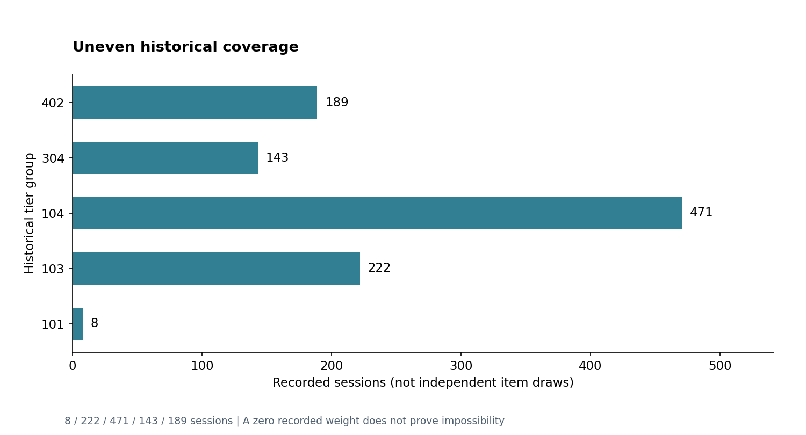
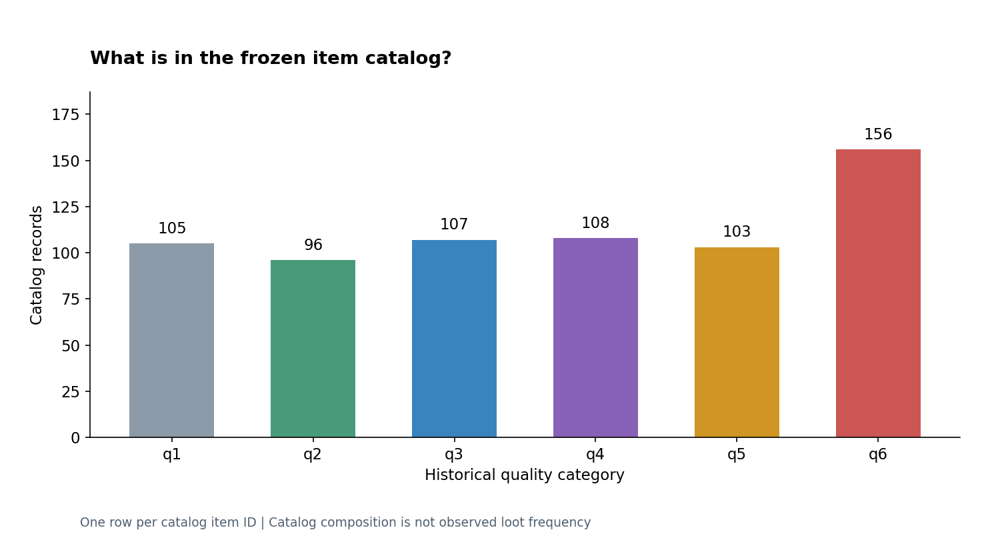

# 旧数据图谱：先问分母，再看颜色

这组图把仓库已经公开的七份旧 JSON 变成可读的研究入口，另为艾莎获选历史摘要重绘一张对照图。
数据来自冻结的 `v0.2.7-hotfix3` 快照，来源 commit、字节数和总清单摘要见
[legacy说明](../../legacy/README.md)；本次没有新增当前游戏表。

## 1. 五档历史品质权重


输入 `quality_weights_measured.json` 的 `by_tier` → 校验有限数、范围与归一和 →
保留五组和五桶 → 堆叠比例。图中 q1 是原件的“q1含q2”，不能再另加 q2。
图上的百分数只作一位小数显示，CSV保留源浮点精度。

原文件“实测权威”的旁注是当时的描述，不作为今天的权威判断。
这里的权重不是单个物品静态池权重，也不是任意地图、英雄或轮次条件下的概率。

## 2. 相同颜色背后，覆盖并不相同



`tier_sessions` 的单位是场次：101/103/104/304/402分别为8/222/471/143/189。
它不是物品条目数，也不是英雄×轮次记录数；图中没有把重复观测当独立抽样。

101组 q6记录权重为0，同时只有8场覆盖。这不能证明该事件不可能。
原公开汇总不提供逐场抽样设计、独立性或足够分组分母，因此不生成置信区间。
快照的Git时间不是采样起止日期；当前缺失的采样窗口就标作未知。

## 3. 静态目录是另一回事



`items_droppable.json` 按唯一 `item_id` 计目录记录，再按 `quality` 分类。
六组为105/96/107/108/103/156条，共675条。红色目录记录多，并不能推出红色实战掉落多：
目录覆盖、池选取权重与实际观察频率不是同一个量。

## 4. 七份输入的角色

| 输入 | 本研究如何使用 | 不作出的推论 |
| --- | --- | --- |
| quality_weights_measured | 权重与场次图 | 当前概率、逐物品独立样本 |
| items_droppable | 唯一ID和品质目录条数 | 实际掉落频率 |
| maps | 文件身份、顶层条目摘要；可供后续研究分组映射 | 当前地图适配完成 |
| heroes / battle_items | 文件身份与顶层结构摘要 | 当前技能/道具语义不变 |
| dropmap_mem_0625 / item_category_mem_0625 | 文件身份与结构摘要 | 所有嵌套字段已逐项解释 |

七表均进入 [snapshot_inventory.csv](../assets/charts/snapshot_inventory.csv) 的文件级SHA-256与字节清单；
顶层条目数只叫“顶层条目数”，不把字典meta key计成业务行数。
第三方底层名称、文字与内容权利仍按 [NOTICE](../../NOTICE.md) 区分。

## 5. 自己重建

```powershell
python -m research.historical_data.generate_charts --csv-only
python -m pip install matplotlib==3.10.8
python -m research.historical_data.generate_charts
```

脚本：[generate_charts.py](../../research/historical_data/generate_charts.py)。
输入路径固定到公开旧快照，不搜索游戏目录；输出默认
`outputs/historical-data/`。仅CSV模式无绘图库依赖。
当前提交的PNG以 Matplotlib 3.10.8生成；不同字体/渲染器可能改变图片字节，
数据CSV和数值测试才是跨机器数据合同。图像白名单约束的是仓库附图本身。

直接读取 [quality_weights.csv](../assets/charts/quality_weights.csv) 或
[catalog_coverage.csv](../assets/charts/catalog_coverage.csv) 也可用自己的绘图工具重建。
[艾莎案例](AISHA_CASE_STUDY.zh-CN.md)中的历史80仓汇总是另一批研究，不能与此处场次数相加。
