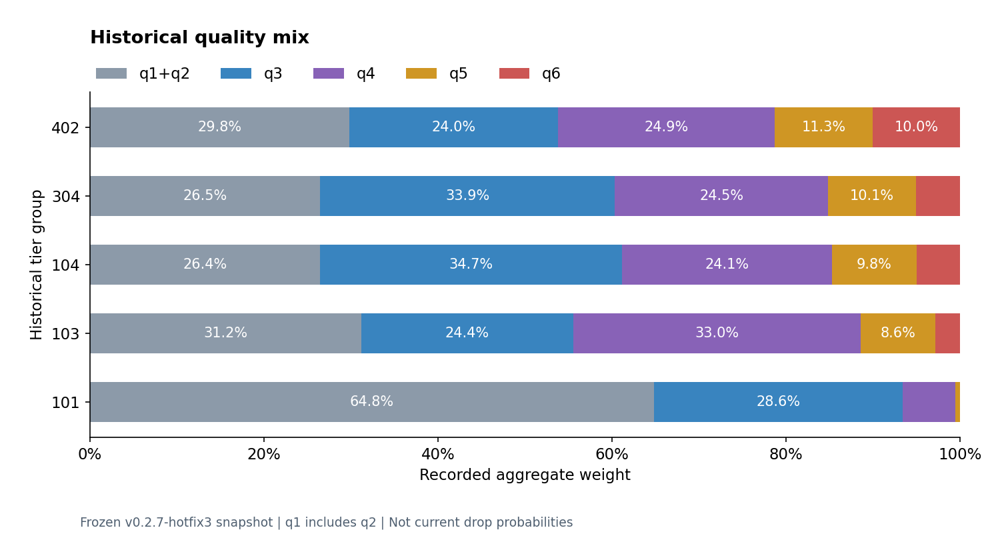

# 从一次“不合理的报价”，读到数据与运行时

为什么信息变多，报价反而消失？为什么红件数猜得更准，总价却更差？
游戏更新后，一张表的哈希变了，究竟要不要改代码？

这些问题把 BidKing 从一个计算器，推向了概率建模、数据语义、工具链与生命周期的交叉地带。
本研究层分享其中可复用的小块：真实旧算法、独立适配代码、虚构样本、历史聚合图，以及没能走通的路。
不玩游戏也可以从 TCP 重组、表差分、离线回放或 C# 调度开始。

[English guide](README.md) · [项目首页](../../README.md) · [首批边界与后续路线](ROADMAP.zh-CN.md) · [精确来源与适配清单](PROVENANCE.json)

## 一条逐步加深的阅读路线

| 想弄清的问题 | 这次交付的实物 | 下一步 |
| --- | --- | --- |
| 信息增加为什么会把候选集挤空？ | 艾莎早轮窗口、可行格域旧 helper，正反例 | [艾莎四个案例](AISHA_CASE_STUDY.zh-CN.md) |
| 合成数据和真实可见信息能差多远？ | 虚构十件仓的轮次可见性、两条字段适配路径 | [运行研究代码](../../research/aisha) |
| 不公开现役参数，也能研究惩罚函数吗？ | 通用小函数、人工参数、逐步CSV与实际运行曲线 | [教学代码](../../research/aisha/penalty_example.py) · [案例解释](AISHA_CASE_STUDY.zh-CN.md) |
| “旧爆率”到底代表什么？ | 三张旧表数据图、艾莎对照图、CSV与生成脚本 | [历史数据图谱](HISTORICAL_DATA.zh-CN.md) |
| 乱序、OCR错字和表变更如何落到具体代码？ | 真实 TCP/OCR/解码函数、有界表差分 CLI | [Python 工具](PYTHON_TOOLS.zh-CN.md) |
| 为什么编译通过仍不能完成一次业务调用？ | 两个 C# 调度/限流类与独立测试程序、Match10 失败复盘 | [Match10 的边界](MATCH10_LESSONS.zh-CN.md) |
| 换成 C++ 薄层是否值得？地址和符号怎样配对？ | 接口与基准协议、身份/ABI实验设计；尚未实现深度实验 | [采集链路](CAPTURE_ARCHITECTURE.zh-CN.md) · [运行时身份](RUNTIME_IDENTITY.zh-CN.md) |
| 61→62张表，怎么避免“解析通过＝兼容”？ | 五名人工表集合、字节/结构/consumer三层方法 | [表变更研究](TABLE_CHANGE_STUDY.zh-CN.md) |

## 先看一张图



这是冻结旧版数据，不是当前游戏概率。灰色桶合并 q1/q2；五档覆盖场次数差异很大。
[对应场次、目录统计与复现方法](HISTORICAL_DATA.zh-CN.md)解释了为什么不能只看柱子就下结论。

## 十分钟运行路径

在仓库根目录运行，Python 3.10+；这些研究模块不需要安装游戏或连接网络：

```powershell
python -m research.aisha
python -m research.aisha.penalty_example
python -m research.transport
python -X utf8 -m research.text
python -m research.tables --help
python -m research.historical_data.generate_charts --csv-only
python scripts/verify.py
```

表差分的完整人工输入命令见[Python工具说明](PYTHON_TOOLS.zh-CN.md)；
Windows C# 入口见[独立runner](../../research/match10-scheduling/run.ps1)。
绘图是可选依赖：`python -m pip install matplotlib==3.10.8`，
再运行 `python -m research.historical_data.generate_charts`。
CSV/重绘图片默认写到忽略的 `outputs/historical-data/`，原七份 JSON 不变。

## 读代码时区分这四层

- `src/auction_inference/`：维护中的标准库工具箱，仍为独立 v0.1.0 API。
- `legacy/`：原56份源码和7份数据的冻结原件，不覆盖、不迁移。
- `research/`：本次选择的历史适配及新教学代码，可从源仓运行，不承诺稳定 API。
- `docs/research/`：历史结论、复现范围和未来实验；“框架”不冒充已经跑通的模块。

来源清单分别标记 `historical_adaptation`、`synthetic_teaching` 与
`historical_aggregate`。真实旧源码不等于完整产品，人工回放不等于真实线上验证，
历史摘要重绘也不等于重新运行了原样本。

## 可以贡献什么

先挑一个可被推翻的小命题：一个 TCP 重叠反例、一张新增列的人工表、
一对遗漏字段的回放、一次可控调度异常，或两个有相同输入的采集 prototype。
[贡献题目](CONTRIBUTION_IDEAS.zh-CN.md)列出了输入、反例和完成条件。
使用 [Research question 模板](../../.github/ISSUE_TEMPLATE/research_question.yml)，不需要先复现整个产品。

工程流程也单独开放在配套
[evidence-first-agent-skills](https://github.com/SeasonCake/evidence-first-agent-skills)；
主线仍是这里能阅读、运行和改造的项目代码。
